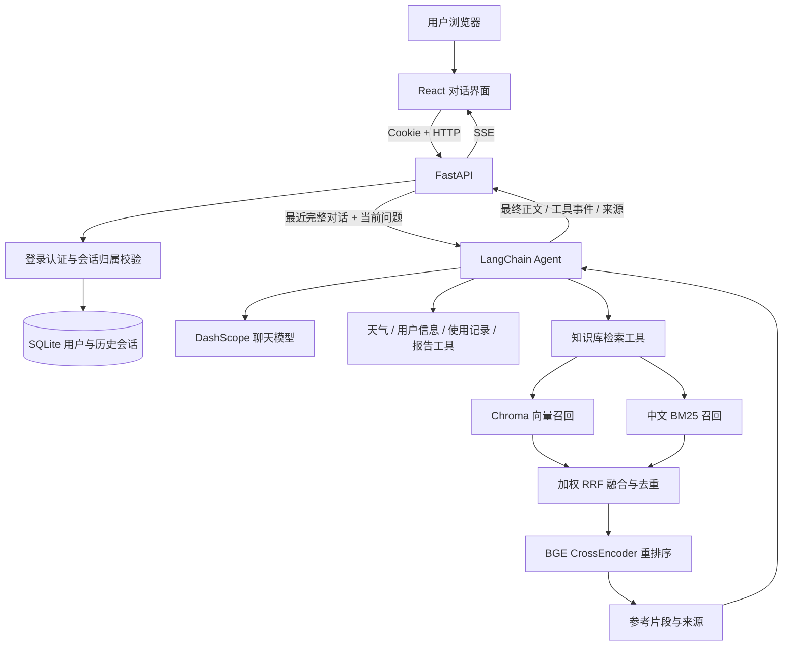

# 智扫通 · Agent 智能客服

> 基于 FastAPI、React 与 LangChain 的扫地机器人智能客服，集成用户登录、历史会话、工具调用，以及 BM25 + 向量检索 + BGE Reranker 知识库问答。

智扫通面向扫地机器人与扫拖一体机器人使用场景，提供产品选购、维护保养、故障排查和使用报告等对话服务。项目由原 Streamlit 应用重构而来，使用 React 构建对话界面，由 FastAPI 统一提供认证、会话和 Agent 流式接口。

**默认启动不需要 MySQL 或 Redis。** 用户与聊天数据存储于 SQLite，产品知识库存储于本地 Chroma，聊天与 Embedding 使用 DashScope，重排序使用本地 BGE 模型。

## 中英文切换 / Language switching

登录页及聊天页右上角可选择 **中文 / English**。首次访问按浏览器语言选择，之后在本机浏览器记住选择。切换覆盖界面、操作提示、工具状态，以及后续 Agent 回答和报告；生成期间暂时禁用切换。历史消息及知识库引用原文保持不变。

接口通过 `Accept-Language: zh` 或 `en` 选择错误提示语言。发送消息时可增加 `"language": "en"`（仅支持 `zh`、`en`），用于本轮 Agent 上下文；正文优先于请求头，均未提供时后端默认中文。语言不写入共享 Agent 状态，各次请求独立。

英文报告支持 `October last year`、`last year October`、`October 2025`、`last month` 等月份表达；单独月份及多月份请求不会被强制归为某一个月份。相对日期以服务器当前日期为准。

验证：`python -m unittest discover -s tests -v`；前端在 `frontend` 中执行 `npm run build`。自动化测试使用替身模型验证语言上下文和提示词，无需调用收费模型。知识库已按界面语言分别接入：中文使用 `data/zh`，英文使用 `data/en`；每轮选择独立索引，不会混合召回。

## 目录

- [核心功能](#核心功能)
- [技术栈](#技术栈)
- [系统架构](#系统架构)
- [项目结构](#项目结构)
- [环境准备](#环境准备)
- [快速启动](#快速启动)
- [配置说明](#配置说明)
- [知识库导入与维护](#知识库导入与维护)
- [混合检索与重排序](#混合检索与重排序)
- [Agent 工具与报告](#agent-工具与报告)
- [登录与历史会话](#登录与历史会话)
- [API 使用说明](#api-使用说明)
- [测试与验证](#测试与验证)
- [部署与数据备份](#部署与数据备份)
- [常见问题](#常见问题)
- [当前边界与扩展方向](#当前边界与扩展方向)

## 核心功能

| 模块 | 已实现能力 |
| --- | --- |
| 用户账号 | 注册、登录、退出登录、当前账号查询 |
| 对话界面 | Markdown 回复、流式展示、工具阶段提示、停止生成、快捷问题 |
| 历史会话 | 新建、列表、查看、继续对话、删除；刷新和重启后保留 |
| 用户隔离 | 会话读取、消息发送、会话删除均校验登录用户归属 |
| 知识库问答 | TXT/PDF 导入、递归分块、Embedding、Chroma 持久化 |
| 混合检索 | 中文 BM25 与向量检索双路召回、加权 RRF 融合 |
| 结果重排序 | 本地 `bge-reranker-v2-m3` 对查询与文档对评分 |
| 来源展示 | 回答附带参考文件名、内容预览及可用的页索引、重排序分数 |
| 工具调用 | 知识检索、城市天气、当前用户、当前月份、个人使用记录与报告 |
| 移动端 | 自适应聊天布局、可展开的历史会话侧栏 |

## 技术栈

| 层次 | 技术 | 用途 |
| --- | --- | --- |
| 前端 | React 19、TypeScript、Vite | 页面、状态与构建 |
| 内容渲染 | react-markdown | 展示 Markdown 回复 |
| 后端 | Python、FastAPI、Uvicorn | HTTP API、认证与 SSE |
| Agent | LangChain、LangGraph | 工具调用、上下文与执行事件 |
| 聊天模型 | ChatTongyi / DashScope | 默认 `qwen3-max` |
| Embedding | DashScopeEmbeddings | 默认 `text-embedding-v4` |
| 向量存储 | Chroma、langchain-chroma | 产品知识库与向量召回 |
| 关键词检索 | rank-bm25 | 中文单字、双字组合和英文词检索 |
| 重排序 | Sentence Transformers CrossEncoder | 本地 BGE 推理 |
| 业务存储 | SQLite、Python sqlite3 | 用户、登录会话、历史消息 |
| 文档解析 | PyPDFLoader、TextLoader | PDF、UTF-8 TXT |
| 测试 | unittest、FastAPI TestClient、Playwright | 接口、检索、Agent 与浏览器流程 |

Python 依赖见 [requirements.txt](requirements.txt)，前端依赖见 [frontend/package.json](frontend/package.json)。前端提供 `package-lock.json`，使用 `npm ci` 按锁文件安装。

## 系统架构



一次正常对话的处理过程：

1. 前端携带登录 Cookie 发送问题，后端验证会话归属。
2. 后端读取该会话最近的完整对话轮次，将其与当前问题一起交给 Agent。
3. Agent 根据问题调用知识库、天气或报告相关工具。
4. 知识库工具完成混合检索与重排序，把参考资料返回给 Agent。
5. 工具阶段和引用来源通过 SSE 独立传回浏览器；模型本轮结束后，仅将不含后续工具调用的回答正文发送给前端。
6. 后端在生成完成、出错或流中断时保存回复内容及状态。正常完成事件在持久化之后发送。

## 项目结构

```text
Agent-master/
├── app.py                       # FastAPI 启动入口
├── app_streamlit.py              # 保留的原 Streamlit 入口
├── backend/
│   ├── main.py                  # 认证、历史会话、聊天 SSE、静态页面
│   ├── store.py                 # SQLite 数据操作、密码和令牌哈希
│   └── runtime.py               # Agent 按需创建与实例复用
├── frontend/
│   ├── src/
│   │   ├── App.tsx              # 登录、会话侧栏、聊天、引用展示
│   │   ├── api.ts               # HTTP 请求与 SSE 解析
│   │   ├── main.tsx             # React 入口
│   │   └── style.css            # 页面与响应式样式
│   ├── dist/                    # npm run build 生成的静态文件
│   ├── browser-check.mjs        # 浏览器自动化检查
│   ├── vite.config.ts           # 开发服务器与 API 代理
│   ├── package.json
│   └── package-lock.json
├── agent/
│   ├── react_agent.py           # Agent 图、文本与工具事件流
│   └── tools/
│       ├── agent_tools.py       # 工具定义、用户上下文和知识检索
│       └── middleware.py        # 工具日志与报告提示词切换
├── rag/
│   ├── vector_store.py          # Chroma 管理、文档解析与导入
│   ├── hybrid_retriever.py      # 中文 BM25、向量召回、RRF
│   ├── reranker.py              # 本地 BGE 加载与重排序
│   └── rag_service.py           # 检索、降级、来源与上下文格式化
├── model/factory.py             # 聊天模型与 Embedding 工厂
├── config/
│   ├── rag.yml                  # 默认模型名称
│   ├── chroma.yml               # 向量库、分块、检索配置
│   ├── agent.yml                # 外部记录配置（旧高德配置不再使用）
│   └── prompts.yml              # 提示词文件路径
├── prompts/                     # 客服、RAG、报告提示词
├── utils/                       # 文件、路径、日志、配置工具
├── data/                        # 待导入的公共产品知识
│   └── external/records.csv     # 示例使用记录
├── chroma_db/                   # Chroma 持久化数据
├── storage/chat.sqlite3         # 启动后自动创建的业务数据库
├── logs/                        # Agent 日志
├── tests/                       # 后端、检索、Agent 与浏览器测试服务
├── docs/fastapi-react.md         # 重构补充说明
├── .env.example                 # 环境变量示例
├── requirements.txt
└── md5.text                     # 已导入文件的内容哈希记录
```

`storage/`、`.venv/`、`frontend/dist/` 等目录可能在首次启动、安装或构建后才出现。

## 环境准备

### 运行条件

| 环境 | 本项目使用方式 |
| --- | --- |
| Python | 建议使用 Python 3.12，与本机重构验证环境一致 |
| Node.js | 使用 Node.js 22.12+ 的兼容版本或 Node.js 24；本机验证使用 Node.js 24 |
| 模型服务 | 可用的 DashScope API Key，以及聊天与 Embedding 模型访问权限 |
| 重排序权重 | 完整的本地 `bge-reranker-v2-m3` 目录 |
| GPU | 非必需，重排序默认使用 CPU |

本说明中的安装和启动命令以 Windows PowerShell 为主。除明确标注 `frontend` 的步骤外，均在 `Agent-master` 根目录执行。

### 安装后端依赖

```powershell
python -m venv .venv
.\.venv\Scripts\python.exe -m pip install -r requirements.txt
```

直接调用虚拟环境解释器，不要求先运行激活脚本。原依赖中的 Streamlit 为保留的旧入口服务，新界面通过 React 使用。

### 安装前端依赖

```powershell
cd frontend
npm ci
cd ..
```

PowerShell 如果拦截 `npm.ps1`，可把命令中的 `npm` 替换为 `npm.cmd`。

### 创建环境配置

```powershell
if (-not (Test-Path -LiteralPath .env)) {
    Copy-Item -LiteralPath .env.example -Destination .env
}
```

编辑 `.env`，填写自己的模型凭证，并检查 BGE 模型路径。`.env` 已加入 Git 忽略规则，不要将实际 Key 写进 README 或提交到仓库。

## 快速启动

### 方式一：前后端分别启动

适合修改前端页面和后端代码时使用。

**终端一：项目根目录，启动后端。**

```powershell
.\.venv\Scripts\python.exe -m uvicorn backend.main:app --reload --host 127.0.0.1 --port 8000
```

**终端二：进入前端目录，启动开发服务器。**

```powershell
cd frontend
npm run dev
```

打开 `http://localhost:5173`，点击“立即注册”，创建账号后开始对话。前端开发代理把 `/api` 请求转发到 `http://127.0.0.1:8000`。

如果 5173 端口被占用，请以 Vite 实际输出为准，并将对应页面 Origin 加入 `FRONTEND_ORIGINS` 后重启后端。

### 方式二：构建后使用一个端口

适合本地演示或不需要前端热更新时使用。

```powershell
cd frontend
npm run build
cd ..
.\.venv\Scripts\python.exe app.py
```

打开 `http://127.0.0.1:8000`。FastAPI 同时提供前端页面和 `/api` 接口。

后端在创建应用时检查 `frontend/dist/`。如果先启动后端、再首次构建前端，需要重启后端。更改端口可直接使用 Uvicorn 命令，例如：

```powershell
.\.venv\Scripts\python.exe -m uvicorn backend.main:app --host 127.0.0.1 --port 8001
```

### 启动后可以检查的地址

| 地址 | 用途 |
| --- | --- |
| `http://localhost:5173` | 前端开发页面 |
| `http://127.0.0.1:8000` | 构建后的单端口页面 |
| `http://127.0.0.1:8000/docs` | Swagger 交互式接口文档 |
| `http://127.0.0.1:8000/redoc` | ReDoc 接口说明 |
| `http://127.0.0.1:8000/api/health` | 基础健康信息 |

健康接口中的 `model_configured` 只表示环境变量中存在 Key，不代表 Key 有效、账户余额充足或模型调用成功。

### 第一次使用

1. 注册账号并登录。
2. 如果是空知识库，先完成下文的文档导入。
3. 发送“扫地机器人经常找不到充电座，应该怎样排查？”等问题。
4. 等待回复，展开“参考资料”查看命中的片段。
5. 刷新页面，从左侧历史会话继续追问。

## 配置说明

### 环境变量

```dotenv
DASHSCOPE_API_KEY=your_dashscope_api_key
CHAT_MODEL_NAME=qwen3-max
EMBEDDING_MODEL_NAME=text-embedding-v4
WEATHERAPI_API_KEY=

RERANKER_MODEL_PATH=../RAGNotebook-master/bge-reranker-v2-m3
RERANKER_DEVICE=cpu

FRONTEND_ORIGINS=http://localhost:5173,http://127.0.0.1:5173
COOKIE_SECURE=false
```

| 变量 | 默认值或行为 | 说明 |
| --- | --- | --- |
| `DASHSCOPE_API_KEY` | 无 | 聊天、Embedding 使用的模型凭证 |
| `CHAT_MODEL_NAME` | `config/rag.yml` 中的 `chat_model_name` | 默认配置为 `qwen3-max` |
| `EMBEDDING_MODEL_NAME` | `config/rag.yml` 中的 `embedding_model_name` | 默认配置为 `text-embedding-v4` |
| `WEATHERAPI_API_KEY` | 空 | WeatherAPI.com 的 Key，仅在后端读取；未配置时天气工具返回明确提示 |
| `RERANKER_MODEL_PATH` | 相邻 RAGNotebook-master 的 BGE 目录 | 相对路径以 Agent-master 根目录解析 |
| `RERANKER_DEVICE` | `cpu` | 可按本机 PyTorch 环境改为 `cuda` |
| `FRONTEND_ORIGINS` | localhost / 127.0.0.1 的 5173 页面 | 逗号分隔的允许来源，不填写路径部分 |
| `COOKIE_SECURE` | `false` | HTTPS 部署时设为 `true` |
| `DATABASE_PATH` | 项目根目录下 `storage/chat.sqlite3` | 可选；自定义相对路径按启动时工作目录解析，建议使用绝对路径 |

**配置优先级：** 当前进程已有的环境变量优先于 `.env`；聊天和 Embedding 模型名称随后回退到 YAML。修改配置后重启后端。

如果更换 `.env` 中的 Key 后仍使用旧账号，请检查启动终端或操作系统中是否已有同名环境变量。无需打印完整 Key 来排查。

### 本地 BGE 模型

本机采用如下相邻目录结构时，可以直接复用已有权重：

```text
LLM_Model/
├── Agent-master/
└── RAGNotebook-master/
    └── bge-reranker-v2-m3/
        ├── config.json
        ├── model.safetensors
        ├── tokenizer.json
        └── ...其他分词器配置文件
```

也可以显式指定其他本地目录，例如 `RERANKER_MODEL_PATH=D:/models/bge-reranker-v2-m3`。程序使用 `local_files_only=True`，不会自动下载缺失权重。

## 知识库导入与维护

### 网页知识库管理

登录后点击聊天侧栏的 **知识库管理 / Manage knowledge**。页面提供中英文知识库切换、文件搜索、文档内容编辑，以及 TXT/PDF 上传和删除。返回聊天时保留当前会话和输入草稿。

- **权限**：默认第一个注册账号为管理员，其他已登录账号只读。也可在 `.env` 设置 `KNOWLEDGE_ADMIN_USERS=alice,bob` 指定管理员用户名（区分大小写）；重启后生效。权限在后端校验，不能通过直接调用接口绕过。
- **上传**：每次一个 TXT 或 PDF，最大 10 MB；TXT 使用 UTF-8。PDF 需未加密、有可提取文本，最多 500 页；扫描件请先 OCR。文档提取内容最多 100 万字符。文件落盘到对应语言目录，并同步写入 Chroma。
- **编辑**：TXT 直接保存；PDF 编辑的是提取文字，保存后转换为同名 TXT，并移除原 PDF 检索片段。若同名 TXT 已存在，操作会被拒绝，避免覆盖。
- **删除**：同步移除文件和索引片段，不再用于后续检索；历史回答及当时引用不会被改写。原文件保留恢复备份。
- **即时生效**：保存完成后更新向量索引并使 BM25 缓存失效；其他服务进程通过版本标记在下一轮检索前刷新，无需为网页操作重启后端。
- **冲突与恢复**：编辑、删除携带 SHA-256 版本，过期版本返回 409，避免覆盖他人修改。按语言使用跨进程文件锁，检索与写入互斥。未完成的写入通过事务记录恢复旧文件及旧向量；恢复前不继续检索该库。
- **备份**：`storage/knowledge_backups/` 保存原文件、原索引片段与操作账号记录；`storage/knowledge_transactions/` 保存锁、恢复日志和缓存版本。不要在请求进行中手动改动这些文件。

管理页面的两种知识库分别维护，不会自动翻译另一语言的内容。界面语言仍决定聊天使用哪一种知识库。

| 方法 | 路径 | 用途 |
| --- | --- | --- |
| GET | `/api/knowledge/{zh或en}/documents` | 文档列表、大小、片段数和当前账号权限 |
| GET | `/api/knowledge/{zh或en}/document?name=...` | 文本内容及版本 |
| POST | `/api/knowledge/{zh或en}/documents?name=...` | 上传原始文件字节（非 multipart） |
| PUT | `/api/knowledge/{zh或en}/document?name=...` | JSON：`content`、`revision` |
| DELETE | `/api/knowledge/{zh或en}/document?name=...&revision=...` | 删除文件和检索内容 |


### 支持的文件

| 类型 | 当前行为 |
| --- | --- |
| `.txt` | 以 UTF-8 读取文本 |
| `.pdf` | 使用 PyPDFLoader 提取文本 |

中文资料放到 `data/zh/`，英文资料放到 `data/en/`。每种语言仅扫描对应目录的直接子文件；使用小写扩展名。`data/external/records.csv` 继续用于使用报告，不会作为知识文档导入。

扫描图片型 PDF 需要先在外部完成 OCR。当前 Agent-master 没有接入 RAGNotebook 的多模态 PDF 解析，已提供知识库管理页面，支持上传含可提取文字的 PDF 和 UTF-8 TXT。

### 导入命令

```powershell
.\.venv\Scripts\python.exe -m rag.vector_store
```

程序依次执行：扫描文件 → 解析与分块 → 检查当前 Chroma 集合中的片段 ID → 为缺失片段调用 Embedding 并写入 → 验证完整性 → 清理同一文件的旧片段 → 记录 MD5。

默认导入两种语言，也可添加 `--language zh` 或 `--language en` 单独导入。导入结束会按语言输出 `imported`、`skipped`、`failed`、`chunks_added` 汇总；有文件失败时退出码为 1。单个文件失败不影响其他文件导入，可修复后重试。只为缺失片段调用 Embedding，完整的文件不会重复请求服务。脚本不再附带无关的示例查询。

### 按界面语言选择知识库

| 界面语言 | 文档目录 | Chroma collection | 索引目录 | 分块 / 重叠字符 |
| --- | --- | --- | --- | --- |
| 中文 | `data/zh` | `agent_zh` | `chroma_db/zh` | 200 / 20 |
| English | `data/en` | `agent_en` | `chroma_db/en` | 700 / 70 |

每轮消息的 `language` 从前端传入 Agent 上下文，`rag_summarize` 依此选择对应的服务实例。向量召回、BM25 缓存、RRF 融合和 BGE 精排都只处理该语言的资料。模型不能通过工具参数切换资料语言；切换界面语言后下一轮立即生效，历史消息与引用保持原样。同一进程同时服务中英文用户时，语言状态互不覆盖。

英文设置位于 `config/chroma.yml` 的 `languages.en`，覆盖顶层中文默认配置。英文采用较长分块以保留问题和答案。空库不回退到其他语言；添加或修改文档后需运行导入命令并重启后端刷新缓存。原单语 `chroma_db` 根目录中的旧集合不再参与检索，可留作回滚备份；不混入新集合。

### 分块与检索参数

配置文件：[config/chroma.yml](config/chroma.yml)。

```yaml
collection_name: agent_zh
persist_directory: chroma_db/zh
k: 3
candidate_k: 12  # 可选；未配置时也使用 12

data_path: data/zh
md5_hex_store: storage/knowledge_zh.md5
allow_knowledge_file_type: ["txt", "pdf"]

chunk_size: 200
chunk_overlap: 20
separators: ["\n\n", "\n", ".", "!", "?", "。", "！", "？", " ", ""]
```

| 参数 | 含义 |
| --- | --- |
| `chunk_size` | 递归字符分块的目标最大长度，按字符数计算 |
| `chunk_overlap` | 相邻片段重叠长度 |
| `candidate_k` | 两路召回各自的候选上限，也是融合后的候选上限 |
| `k` | 最终返回给 Agent 的重排序片段上限 |
| `collection_name` | Chroma 集合名称 |
| `persist_directory` | Chroma 数据目录 |

### 增量导入与重建

- 只有当前集合内的片段 ID 与源文件分块结果一致时才跳过。每种语言的 `storage/knowledge_*.md5` 仅作为兼容记录，不能证明向量实际存在。
- 新增文件后再次运行导入命令即可。BM25 会在后续请求中按最长 60 秒的缓存周期刷新，重启服务也会重新加载。
- 修改已有文件或分块配置后，补齐新片段并验证成功，再清理该路径的旧版本片段。写入失败保留旧片段，重试会补齐缺失内容。
- 从知识库管理页面删除文档，会同步删除其 Chroma 片段并刷新 BM25；直接在文件系统中删除源文件仍不会自动清理旧片段。
- 即使保留了旧 `md5.text`，空集合、新集合或片段缺失也能通过再次运行导入命令修复；无需手动删除哈希记录。

需要重建或更换 Embedding 模型时，先停止相关服务，保留旧数据备份，再为向量目录、集合和 MD5 文件配置一组新名称，例如：

```yaml
collection_name: agent_v2
persist_directory: chroma_db_v2
md5_hex_store: md5-v2.text
```

重新导入并确认结果后再使用新索引。不要将不同 Embedding 模型或不同维度的向量混入同一集合。

## 混合检索与重排序

### 检索链路

```text
Agent 提供检索词
    ├── Embedding → Chroma 相似度召回
    └── 中文/英文分词 → BM25 关键词召回
                    ↓
             加权 RRF 融合与去重
                    ↓
        BGE 对“查询—候选片段”逐对评分
                    ↓
             按分数降序取 Top-K
                    ↓
           返回参考文本与来源给 Agent
```

**BM25：** 从 Chroma 读取同一份文档内容，构建进程内索引。分词包含中文单字、连续中文的双字组合，以及转为小写的英文和数字词，有助于匹配故障码、部件名等明确词项。

**向量检索：** 使用 Embedding 表达查询语义，再从 Chroma 召回语义相关的片段。

**融合：** 根据查询字符长度设置启发式权重，通过排序位置融合两路结果，而不直接相加不同量纲的原始分数。

| 查询长度 | 向量权重 | BM25 权重 |
| --- | --- | --- |
| 少于 20 字符 | 0.3 | 0.7 |
| 20～50 字符 | 0.5 | 0.5 |
| 超过 50 字符 | 0.7 | 0.3 |

当前实现对每一路中的第 `rank` 名片段累加 `weight / (60 + rank)`，`rank` 从 1 开始。文件来源、页索引与正文共同构成去重键。该权重规则是当前实现的启发式策略，不代表已通过业务评测得到最优参数。

**BGE 重排序：** 将查询与候选正文成对送入 CrossEncoder，按模型输出分数降序排列。当前代码使用 `max_length=512`、推理批大小 `8`，最终片段数由 `k` 控制。模型首次使用时加载，后续复用实例；同一实例的加载和推理使用锁保护。

### 降级与引用

BGE 加载或推理失败时，系统使用混合召回顺序的前 `k` 个片段，并向界面发送明确的降级提示。知识库为空时返回没有找到相关资料的提示。

每个引用可包含：

- `title`：来源文件名。
- `preview`：正文前 260 个字符。
- `page`：文档解析器提供的原始页索引，可能为空，不应直接视为印刷页码。
- `rerank_score`：重排序模型输出；降级时可能为空，不是回答正确率。

## Agent 工具与报告

| 工具 | 作用 |
| --- | --- |
| `rag_summarize` | 返回混合检索与重排序后的参考资料，并记录引用 |
| `get_weather` | WeatherAPI 全球当前天气，支持城市搜索、同名城市确认和浏览器位置 |
| `get_user_location` | 根据浏览器授权位置返回天气服务匹配的城市、地区和国家 |
| `get_user_id` | 返回当前登录用户的真实 UUID |
| `get_current_month` | 按后端系统时间返回 `YYYY-MM` |
| `fetch_external_data` | 读取当前账号绑定的模拟记录，月份留空时使用最新可用月份 |
| `fill_context_for_report` | 触发报告场景的提示词切换 |

用户身份、模拟用户绑定、报告标记与引用列表通过每次请求独立的 `ToolRuntime` 上下文传递。`fetch_external_data` 仅向模型公开可选的 `month` 参数，模拟 ID 由后端提供。登录 UUID 继续用于账号和会话归属。

### WeatherAPI 全球天气与当前位置

在项目根目录 `.env` 中添加 `WEATHERAPI_API_KEY=你的Key`，保存后重启后端。Key 从环境变量读取，不放进 React、对话或工具参数。旧 `GAODE_API_KEY` 和 `config/agent.yml` 中的高德配置不再用于天气、定位。

工具先请求 `https://api.weatherapi.com/v1/search.json` 查找城市，保留城市、国家、省州和经纬度，再用经纬度请求 `/current.json`，通过 `lang=zh` 获取中文天气描述。输入“澳大利亚悉尼现在天气如何”“英国伦敦天气如何”即可查询海外天气。中文地名没有结果时，Agent 可用标准英文名重试一次。

`get_weather(city, country, location_id)`：country 使用英文国家全称；同名城市无法唯一确定时返回候选，Agent 根据用户明确指定的国家/省州选择本轮候选的 location_id，否则询问用户。不能猜 ID 或无条件取第一个城市。天气结果包含实际匹配地点、温度/体感温度（℃）、湿度（%）、风速（km/h）、风向、降水量（mm）、当地更新时间和 WeatherAPI.com 来源。当前实现提供实况，不包含未来预报。

查询“我在哪里”或“这里天气如何”前，点击输入框上方的 **使用当前位置**，由浏览器提示位置授权；拒绝、超时或不支持定位时可手动输入城市和国家。浏览器定位需要 HTTPS 或 localhost 等可信本地地址。浏览器/设备可能只能提供近似位置，返回城市是天气服务匹配地点，不是精确街道地址。

授权得到的坐标只保存在当前页面内存中，随后续消息作为可选 `location` 请求字段传给后端，最多使用 5 分钟；刷新页面、退出登录、过期或点击 **取消共享** 后需重新授权/获取。坐标不单独写入数据库；用户主动查询得到的所在地文字回复会作为普通聊天历史保存。已经发送的请求不受之后取消共享影响。

后端校验经纬度范围与获取时间，Agent 从请求上下文读取坐标，不使用服务器 IP、`auto:ip` 或模型猜测的位置。同一轮里定位和当前天气查询复用一次 WeatherAPI 响应。密钥缺失/无效、额度耗尽、无套餐权限、城市未找到和网络失败会返回不同提示；不会将带 Key 的请求 URL 放入工具回复。

接口请求示例（location 可省略；captured_at 为获取位置时的 Unix 秒数）：

```json
{"content":"这里天气如何？","location":{"latitude":-33.8688,"longitude":151.2093,"captured_at":1789257600}}
```

示例时间戳需替换成实际获取时间。参考：[WeatherAPI 文档](https://www.weatherapi.com/docs/)、[浏览器定位](https://developer.mozilla.org/en-US/docs/Web/API/Geolocation_API)。

### 工具参数、重试与正文展示

查询当前位置天气推荐调用 `get_weather({})`。工具参数在 Pydantic 校验前将 location_id 的字符串 `"None"`、`"null"` 和空白统一规范化为空值；city/country 的 JSON null 使用默认空字符串。真正无效的 ID 仍会触发校验，不会被当作当前位置。

监控中间件区分成功、参数/业务错误及待确认地点。LangChain 返回错误 ToolMessage 或业务 JSON 中含 error 时，不再记录“调用成功”；同名城市候选记录为需要确认条件。

Agent 通过 LangGraph 的 updates 事件等待每轮模型响应完成。带有工具调用的那轮文本（如“让我重试”）不发到正文，也不存入用户可见的历史回答；工具调用过程继续显示状态。最终不带工具调用的完整回答通过 SSE 的 token 事件发送，前端与历史记录保持一致。这会延迟正文首字显示，当前不逐 token 展示未完成的模型回复。最终查询失败的解释仍正常展示。

`tests/test_tool_retry.py` 使用真实 LangChain 图和 FastAPI SSE 链路，验证字符串空值只触发一次天气执行、真正错误后的恢复、日志状态以及最终正文持久化。

### 模拟使用报告与账号分配

本项目的报告用于演示，数据来自 `data/external/records.csv`，不需要接入真实设备或将 CSV 用户 ID 改为登录 UUID。文件包含 **1001～1010 共十个模拟用户、每人十二个月，共 120 条记录**，月份为 **2025-01～2025-12**。

后端启动时按已有账号的注册顺序，将 CSV 中首次出现的用户 ID 依次分配：

| 账号注册顺序 | 绑定的模拟用户 ID |
| --- | --- |
| 第一个账号 | 1001 |
| 第二个账号 | 1002 |
| …… | …… |
| 第十个账号 | 1010 |

旧账号表没有注册时间字段，迁移时以 SQLite `users.rowid` 的插入顺序为准。绑定持久化在 `report_assignments` 表中，重复启动不会重新分配。新注册账号在同一事务内领取下一个尚未使用的模拟用户；名额用完后仍可登录、聊天，但报告工具会说明没有可分配的模拟记录。不会循环复用其他账号的绑定。

- 输入“生成一份使用报告”：自动读取所绑定模拟用户的最新数据，目前为 **2025 年 12 月**。
- 输入“生成 2025 年 3 月使用报告”：读取该月数据。
- 明确请求“本月报告”或其他无数据月份：说明没有记录，列出可用月份，不擅自换月。
- 报告标题与开头注明“模拟数据报告”、模拟用户 ID、实际月份及 CSV 来源，不将其描述为登录用户的真实设备记录。

CSV 使用以下表头；字段通过 `csv.DictReader` 按列名读取，支持 UTF-8 / UTF-8 BOM、标准引号转义、字段内逗号与换行，原文件中的字面量 `\n` 转换为换行：

```csv
用户ID,特征,清洁效率,耗材,对比,时间
1001,日常清扫,按模拟记录填写,按模拟记录填写,按模拟记录填写,2025-12
```

每个用户同一月份只允许一条记录；缺少表头、错误月份或重复记录会提示数据文件有误。每次查询重新读取 CSV，因此修改已有记录后无需重启；增加模拟用户 ID 后重启服务，以便为尚未分配的账号补充分配。删除已经绑定的模拟 ID 不会自动更换账号绑定，查询时会提示该 ID 已无记录。CSV 不可用时普通认证与对话仍可启动，报告返回明确错误。

### 相对报告月份的计算

每次用户请求开始时，后端按系统本地时区获取当天日期，并在本轮内固定使用这份日期快照。客服与报告提示词都动态注入该日期；`get_current_month` 也读取相同快照，避免跨午夜时前后不一致。

`utils/report_dates.py` 从本轮最新用户消息中解析明确的单个月份，例如“去年十月”“前年12月”“今年一月”“上个月”“本月”“下个月”及 `2025-10`、`2025年十月`。以 2026-09-13 为例，“去年十月”固定解析为 **2025-10**；2026 年 1 月的“上个月”为 **2025-12**。日期由运行时计算，不硬编码年份。

工具中间件在校验和执行前用已解析月份纠正模型参数，记录实际查询月份；记录工具再次以该月份读取数据，并返回实际 month 与 reference_date。即使模型错误传入 2023-10，本轮明确请求“去年十月”时也不会查询错误年份。明确指定的绝对年月按用户指定值处理；无数据时保留该月份返回暂无记录。

无明确月份时保留最新模拟月份的默认行为。仅说“十月”、跨多个月份或复杂区间时，程序不会强行套用第一个月份，由 Agent 结合当前日期和上下文解析，必要时询问用户。历史消息中的年份不会覆盖本轮明确月份。

回归测试 `tests/test_report_dates.py` 覆盖相对年份、中文月份、跨年计算，以及真实 Agent 图上模型传错年份后的参数纠正。

### 通义工具调用的流式兼容

`model/tongyi_stream.py` 使用 DashScope 的 `incremental_output=True` 接收增量工具参数，避免社区适配器在累计响应相减时读取缺失的 `function.name` 而抛出 `KeyError: 'name'`。同时保留服务端的工具调用 `index`，避免多个工具的稀疏分块被拼接到同一个调用，并兼容文本块形式的内容。

修复位于项目内，通过 `model/factory.py` 使用，不需要修改 `.venv/Lib/site-packages`。参考：[阿里云 Function Calling 流式说明](https://help.aliyun.com/en/model-studio/qwen-function-calling)。

## 登录与历史会话

### 账号与登录凭证

- 用户名长度为 3～32 字符，允许文字、数字、下划线和短横线。
- 密码长度为 8～128 字符，使用随机盐与 scrypt 哈希存储。
- 登录后签发随机会话令牌，浏览器通过 `agent_session` Cookie 携带。
- Cookie 使用 `HttpOnly`、`SameSite=Lax`，有效期为 7 天。
- 数据库仅保存令牌的 SHA-256 摘要；退出登录会撤销当前令牌。
- 前端不需要读取或在本地存储中维护令牌，也不使用 JWT Bearer 认证。

### 数据表

| 表 | 内容 |
| --- | --- |
| `users` | 账号 ID、用户名、密码盐、密码哈希 |
| `logins` | 令牌摘要、用户 ID、到期时间 |
| `report_assignments` | 登录账号与模拟用户 ID 的唯一绑定、分配时间 |
| `conversations` | 会话归属、标题、创建/更新时间、生成租约 |
| `messages` | 消息角色、正文、生成状态、引用与创建时间 |

SQLite 启用外键和 WAL。默认数据库在后端首次启动时自动创建，删除会话会级联删除其消息。

### 历史上下文与生成状态

会话标题默认从第一条问题截取前 30 个字符。历史列表按更新时间降序显示。

每次发送问题，后端从数据库筛选最近 **10 轮完整的用户—助手对话**，加上当前问题传入 Agent。历史列表可以展示更早的消息，但这些消息不会全部进入模型上下文。

| 消息状态 | 含义 |
| --- | --- |
| `streaming` | 当前正在生成，或上次异常退出后尚未清理的占位消息 |
| `complete` | 正常完成 |
| `error` | 生成失败、超时或没有有效文本 |
| `interrupted` | 流被中断，或过期轮次被新请求标记为中断 |

失败和中断轮次保留供用户查看，不作为后续完整轮次传入模型。单条问题上限为 12000 字符，空白问题会被拒绝。

同一会话生成期间拒绝再次发送和删除，返回 `409`。生成租约有效期为 240 秒，流式生成超时为 180 秒；旧请求不能覆盖新租约的回答。

## API 使用说明

### 接口列表

| 方法 | 路径 | 认证 | 说明 |
| --- | --- | --- | --- |
| GET | `/api/health` | 否 | 基础健康信息 |
| POST | `/api/auth/register` | 否 | 注册并登录，成功返回 201 |
| POST | `/api/auth/login` | 否 | 登录 |
| POST | `/api/auth/logout` | 不要求已登录 | 撤销当前 Cookie 令牌，返回 204 |
| GET | `/api/auth/me` | 是 | 当前用户 |
| GET | `/api/conversations` | 是 | 当前用户的会话列表 |
| POST | `/api/conversations` | 是 | 新建会话，返回 201 |
| GET | `/api/conversations/{id}` | 是 | 会话信息与消息 |
| DELETE | `/api/conversations/{id}` | 是 | 删除会话，成功返回 204 |
| POST | `/api/conversations/{id}/messages` | 是 | 发送问题并接收 SSE |

### PowerShell 请求示例

以下示例使用同一个 WebSession 保存 Cookie。第一次运行使用注册；账号已存在时将 `/auth/register` 改为 `/auth/login`。

```powershell
$baseUrl = 'http://127.0.0.1:8000/api'
$credentials = @{
    username = 'demo_user'
    password = 'example-password-123'
} | ConvertTo-Json

$account = Invoke-RestMethod -Method Post `
    -Uri "$baseUrl/auth/register" `
    -ContentType 'application/json' `
    -Body $credentials `
    -SessionVariable chatWebSession

$conversation = Invoke-RestMethod -Method Post `
    -Uri "$baseUrl/conversations" `
    -WebSession $chatWebSession

$conversationId = $conversation.id

Invoke-RestMethod -Uri "$baseUrl/conversations" -WebSession $chatWebSession
Invoke-RestMethod -Uri "$baseUrl/auth/me" -WebSession $chatWebSession
```

聊天请求正文格式：

```json
{"content":"扫地机器人找不到充电座，应该怎样排查？"}
```

聊天接口返回 `text/event-stream`，不是一个完整的 JSON 对象。浏览器端使用 `fetch` 读取 POST 响应流，解析逻辑见 [frontend/src/api.ts](frontend/src/api.ts)。

### SSE 协议

每个事件以 `data: ` 开头，内容为 JSON，以两个换行结束。例如：

```text
data: {"type":"start","message_id":"assistant-message-uuid"}

data: {"type":"tool","name":"rag_summarize","message":"正在调用工具"}

data: {"type":"token","content":"可以先检查充电座周围是否有障碍物。"}

data: {"type":"sources","sources":[{"title":"故障排除.txt","page":null,"preview":"检查充电座与周围环境。","rerank_score":0.92}]}

data: {"type":"done"}
```

上面的正文和分数仅为协议示例，不代表实际检索结果。

| 事件 | 用途 |
| --- | --- |
| `start` | 返回本次助手消息 ID |
| `token` | 追加文本增量 |
| `tool` | 工具名称与执行阶段 |
| `sources` | 本次回答的引用列表 |
| `warning` | 可继续回答的降级提示 |
| `done` | 正常结束 |
| `error` | 终止生成，使用 `message` 展示错误 |

空闲等待期间可能收到 `: heartbeat` 注释帧，客户端应忽略。`error` 后不保证再收到 `done`。首次请求校验失败时，返回普通 HTTP 错误；已经开始 SSE 后的生成错误通过事件传递。

### 常见状态码

| 状态码 | 场景 |
| --- | --- |
| 401 | 未登录、令牌失效或登录凭证错误 |
| 403 | 写请求携带了不允许的 Origin |
| 404 | 会话不存在，或不属于当前账号 |
| 409 | 用户名重复，或会话正在生成 |
| 422 | 用户名、密码、问题等参数不符合约束 |
| 503 | 未配置 `DASHSCOPE_API_KEY` 时请求正式聊天 |

## 测试与验证

### 后端、Agent 与检索测试

```powershell
.\.venv\Scripts\python.exe -m unittest discover -s tests -v
```

当前测试集包含 15 项测试：

| 文件 | 主要覆盖内容 |
| --- | --- |
| `tests/test_backend.py` | 登录与退出、哈希、跨用户隔离、持久化、多轮上下文、失败状态、生成租约、Origin 与参数校验 |
| `tests/test_retrieval.py` | 中文分词、BM25 补充召回、RRF 去重、缓存刷新、空库、重排序输入与输出 |
| `tests/test_agent.py` | 实际 LangChain 图的工具调用、用户身份传递、来源收集、报告工具身份参数隔离 |

`tests/test_reports.py` 覆盖旧账号迁移、并发注册分配、绑定持久化、名额耗尽、CSV 解析与月份选择；`tests/test_tongyi_stream.py` 覆盖工具名称缺失的分块、并行工具索引、文本块和完整报告 Agent 流。

自动化测试使用固定模型回复和受控检索数据，不需要真实模型调用；重排序单元测试使用模拟评分，并不加载完整 BGE 权重。

### 前端构建检查

```powershell
cd frontend
npm run build
```

命令先进行 TypeScript 检查，再构建静态资源。

### 浏览器流程测试

此测试脚本使用 Windows Edge，需要先完成前端构建。

**终端一：根目录启动测试专用服务。**

```powershell
.\.venv\Scripts\python.exe -m uvicorn tests.browser_server:app --host 127.0.0.1 --port 8017
```

**终端二：安装临时测试依赖并执行。**

```powershell
cd frontend
npm install --no-save --package-lock=false @playwright/test
node browser-check.mjs
```

覆盖注册、对话 SSE、参考资料、刷新后查看历史、停止生成、账号隔离、移动端宽度和前端运行错误。测试截图与数据库位于 `.qa/`。

测试服务使用固定回复；正式入口是 `backend.main:app`。不要把 `tests.browser_server:app` 当作正式模型服务部署。测试结束后可在测试服务终端按 `Ctrl+C` 退出。

### 重构时的验证记录

- 15 项自动化测试通过。
- React 生产构建与浏览器流程验证通过。
- 本地 BGE 权重成功加载，并完成实际重排序推理。
- 当时使用的 DashScope 账户返回 `Arrearage`，因此未完成该账户下的真实云模型回答验证。账户状态会变化，请以自己的有效 Key 实际验证。

以上记录不代表检索准确率、响应时延或高并发能力的量化评测结论。

## 部署与数据备份

### 单实例部署

当前实现以单实例应用为基础，使用 SQLite 与本地 Chroma。部署时先构建前端，再启动 FastAPI；`--reload` 仅用于开发。

如果通过外部反向代理提供 HTTPS，需要正确转发 `/api` 与静态资源，并关闭 SSE 路径的响应缓冲。例如，已有 Nginx 环境可参考以下 `location` 配置片段：

```nginx
location / {
    proxy_pass http://127.0.0.1:8000;
    proxy_http_version 1.1;
    proxy_set_header Host $host;
    proxy_set_header X-Forwarded-Proto $scheme;
    proxy_set_header X-Forwarded-For $proxy_add_x_forwarded_for;
    proxy_buffering off;
    proxy_cache off;
    proxy_read_timeout 240s;
}
```

该片段不是仓库内置部署脚本，需要结合现有域名、证书与受信任代理配置使用。为实际页面设置 `FRONTEND_ORIGINS`，HTTPS 下设置 `COOKIE_SECURE=true`。当前仓库未提供此次重构对应的 Docker Compose 文件。

### 数据位置与备份

| 路径 | 备份内容 |
| --- | --- |
| `storage/` | 用户、登录令牌摘要、会话、消息与引用 |
| `chroma_db/` | 向量库及其文档元数据 |
| `md5.text` | 兼容旧版的文件哈希记录；是否已导入以 Chroma 中实际片段为准 |
| `data/` | 原始知识文档与外部使用记录 |
| `config/`、`prompts/` | 参数与提示词 |
| `.env` | 本机凭证和环境配置，需单独妥善保管 |

简单本地备份可先停止服务和导入任务，再复制这些文件/目录。不要在数据库仍写入时仅复制 `chat.sqlite3` 而忽略 WAL 状态。已有重构备份如存在，保存在 `.refactor-backup/`。

原 Streamlit 的聊天记录保存在其运行时内存中，不会自动迁移到新账号数据库。原有公共知识库可以继续使用。

## 常见问题

### 页面能打开，为什么无法回答？

账号与历史功能不依赖模型调用成功。检查 `.env`、启动进程环境变量、模型权限和账户状态，并查看后端终端及 `logs/` 中的错误。

### DashScope 返回 `Arrearage`

表示服务端因账户欠费或账户状态受限而拒绝请求。恢复账户状态或更换可用 Key，再重启后端。仅看到 `model_configured: true` 不能排除该问题。

### BGE 重排序不可用

检查 `RERANKER_MODEL_PATH` 是否指向实际包含 `config.json`、权重和分词器文件的目录。GPU 模式失败时检查 PyTorch/CUDA 环境，或使用默认 CPU。程序不会自动下载缺失文件；降级时界面会明确提示使用混合检索结果。

### 有资料文件，但知识库检索不到

确认已运行导入命令、文档确实写入当前 collection、文件格式受支持，以及 PDF 能提取文本。只把文件复制到 `data/zh/` 或 `data/en/` 不会自动触发导入。空集合或缺失片段可再次运行导入命令恢复，检查汇总中的 `failed` 应为空。导入后重启后端以刷新检索缓存；单独的导入进程与运行中的后端不会共享内存索引状态。

### 切换 Embedding 后出现维度不一致

旧向量不能直接用于另一个维度或语义空间的 Embedding 模型。使用新的集合、向量目录与 MD5 文件重新建库，详见“增量导入与重建”。

### 登录后请求仍然是 401 或 403

浏览器访问地址统一使用 `localhost` 或统一使用 `127.0.0.1`，不要混用 Cookie。确认页面 Origin 在允许列表中。本地 HTTP 环境保持 `COOKIE_SECURE=false`，否则浏览器可能不发送 Secure Cookie。

### 后端根路径显示 404

分离开发模式应访问 Vite 的 5173 页面。单端口模式需先构建 `frontend/dist/`，再重启 FastAPI。`/docs` 可用于确认后端是否已启动。

### `npm run preview` 能打开页面但接口失败

当前 Vite 配置只为开发服务器定义 `/api` 代理。完整单端口演示请使用 `npm run build` 后启动 `app.py`，不要将 preview 当作已经配置 API 代理的服务。

### 点击停止后，为什么模型请求可能仍在后台执行？

停止按钮中断浏览器响应流，服务端保存已经接收到的部分回答。但底层同步 SDK 调用可能需要等待返回，无法保证即时取消已提交的云模型请求或避免其计费。

### 新账号无法生成个人使用报告

重启后端后，已有账号和新账号会依注册顺序绑定 CSV 模拟用户，最多十个账号。先尝试“生成一份使用报告”，默认读取 2025-12；“本月”会按真实当前月份查询，可能没有记录。若仍无记录，检查 CSV 是否有效、`report_assignments` 是否存在绑定，以及十个名额是否已经用完。无需修改登录 UUID 或 CSV 中的数字 ID。

### 重启后某条消息一直显示尚未完成

异常退出可能留下 `streaming` 占位记录。生成租约到期后再次发送消息，会将旧占位记录标记为中断。服务刚异常退出时，最多需要等待原 240 秒租约到期。

## 当前边界与扩展方向

当前公共产品知识库由服务端文件导入维护，聊天数据按账号隔离。项目已提供管理员知识库上传、编辑与删除页面；尚未提供私有知识库、密码找回、历史消息全文搜索或历史列表分页。

现有 BM25 缓存在单进程内，BGE 推理使用实例锁，流式生成使用后台线程与有界队列。要扩展到大量文档或多实例服务，可以进一步考虑持久化关键词索引、独立推理服务、任务队列和更完善的数据库迁移机制，并建立真实业务评测集衡量召回、排序与回答质量。

重构补充说明见 [docs/fastapi-react.md](docs/fastapi-react.md)。接口以当前代码和运行时 `/docs` 为准。

天气回归测试位于 `tests/test_weather.py`，覆盖同名城市、国家过滤、当前位置、过期位置、接口错误与 Key 脱敏；前端定位验证脚本为 `frontend/weather-browser-check.mjs`。
