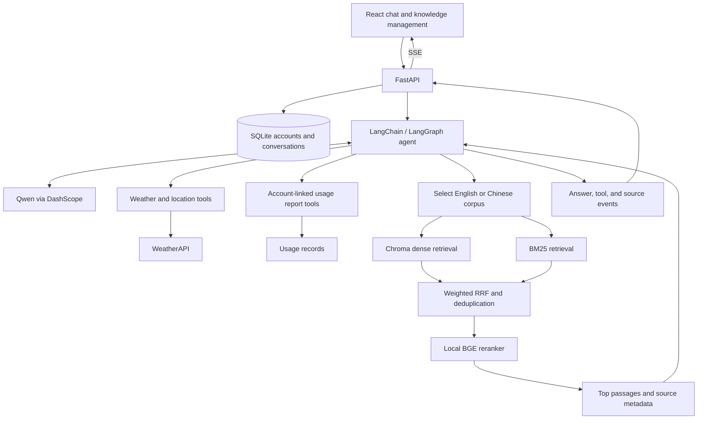

# SweepWise

**An AI support assistant for robotic vacuums, powered by tool-calling agents and hybrid retrieval.**

SweepWise brings product knowledge, live weather, and account-linked usage records into a conversational support experience. It helps users troubleshoot cleaning problems, maintain their devices, compare products, and generate monthly usage reports. English and Chinese interfaces use separate knowledge indexes, so retrieval follows the language selected in the application.

**Core stack:** Python · LangChain · LangGraph · Qwen · Chroma · BM25 · BGE Reranker · FastAPI · React · TypeScript · SQLite

## Features

- **Agent-driven support:** A LangChain agent backed by LangGraph chooses knowledge, weather, location, and reporting tools across multiple conversation turns.
- **Hybrid RAG:** BM25 and dense retrieval feed a weighted reciprocal rank fusion stage, followed by local BGE cross-encoder reranking.
- **Traceable answers:** Retrieved passages include document names, text previews, available page metadata, and reranking scores.
- **Bilingual knowledge routing:** English and Chinese have independent source folders, Chroma collections, and BM25 corpora.
- **Contextual recommendations:** WeatherAPI supplies location search and current weather to support location-aware maintenance advice.
- **Monthly reports:** Report tools read the records assigned to the authenticated account and resolve relative dates against the server's current date.
- **Knowledge management:** Administrators can upload, edit, and delete documents in the browser; other signed-in users have read-only access.
- **Persistent conversations:** Account authentication, conversation ownership checks, Markdown answers, source references, and tool status events are built into the chat interface.

## Architecture



### Agent execution

Each request carries its own authenticated user, selected language, available browser location, and date context. Tools obtain account identity from this runtime context rather than accepting a model-generated account ID.

The agent uses a dynamic prompt for general support or report generation. Report middleware applies the resolved month to the data lookup, helping prevent errors such as interpreting "October last year" against an outdated year.

Tool outcomes distinguish successful execution, requests for clarification, and errors. The UI receives these outcomes through Server-Sent Events (SSE). Model messages are checked for tool calls before their text is displayed, so an intermediate planning message is not shown as the final answer. Answer text is emitted after a completed model message; this is not a guarantee of token-by-token delivery.

| Tool | Purpose |
| --- | --- |
| `rag_summarize` | Retrieve supporting passages from the selected language's knowledge base. |
| `get_weather` | Retrieve current weather for a city or available location. |
| `get_user_location` | Resolve location information for subsequent tool use. |
| `get_user_id` | Read the authenticated account ID from runtime context. |
| `get_current_month` | Return the month from the request's reference date. |
| `fetch_external_data` | Read the account's assigned records for the requested month. |
| `fill_context_for_report` | Trigger the report-specific prompt for the following model call. |

### Retrieval pipeline

1. **Parse and split:** Load UTF-8 TXT files and text-extractable PDFs, then split them with `RecursiveCharacterTextSplitter`.
2. **Embed and persist:** Generate DashScope embeddings and store chunks with source and language metadata in Chroma.
3. **Retrieve through two paths:** Fetch up to 12 dense candidates and up to 12 BM25 candidates from the selected language's corpus.
4. **Fuse and deduplicate:** Combine ranks with weighted RRF using a rank constant of 60, retaining up to 12 unique candidates. Query length determines the dense/sparse weights.
5. **Rerank locally:** Score query-passage pairs with `bge-reranker-v2-m3` and return the top 3 passages by default.
6. **Generate with references:** Pass the retrieved context to the agent and expose source metadata in the chat UI.

English lexical retrieval uses lowercase alphanumeric tokens. Chinese retrieval also includes individual characters and adjacent character pairs. Short queries favor BM25; longer queries favor dense retrieval. These are implementation heuristics, not measured quality guarantees.

Current defaults in [config/chroma.yml](config/chroma.yml):

| Setting | English | Chinese |
| --- | --- | --- |
| Source folder | `data/en/` | `data/zh/` |
| Chroma directory | `chroma_db/en/` | `chroma_db/zh/` |
| Collection | `agent_en` | `agent_zh` |
| Chunk size / overlap | 700 / 70 characters | 200 / 20 characters |

There is no automatic fallback to the other language's corpus. If BGE cannot load or inference fails, retrieval falls back to the fused hybrid ranking and returns a warning.

## Getting started

### Prerequisites

- Python 3.12 for the setup below.
- Node.js 22.12 or later, with npm.
- A DashScope API key with access to the configured chat and embedding models.
- A WeatherAPI key to enable weather and location tools.
- The complete local `bge-reranker-v2-m3` model folder to enable reranking. CPU is the default device; a GPU is optional.

Chat and embedding requests require network access and are subject to the provider's account limits and billing. Reranking runs locally.

The following commands use **Windows PowerShell**. Run them from the repository root unless a step explicitly changes directories.

### 1. Clone and install

```powershell
git clone https://github.com/Sodame/SweepWise.git
Set-Location SweepWise

py -3.12 -m venv .venv
.\.venv\Scripts\python.exe -m pip install -r requirements.txt

Set-Location frontend
npm ci
Set-Location ..
```

If PowerShell blocks `npm.ps1`, use `npm.cmd` in place of `npm`. If the Python launcher is unavailable, use your Python 3.12 executable in place of `py -3.12`.

### 2. Download the BGE reranker

**Model weights are not included in this repository and are not downloaded automatically.**

**Dropbox download:** [bge-reranker-v2-m3.zip — link pending](https://www.dropbox.com/REPLACE_WITH_BGE_RERANKER_DOWNLOAD_LINK)

> This URL is a placeholder. The maintainer must replace it with the shared Dropbox download link before the model archive can be downloaded from this README. Until then, a checkout can run hybrid retrieval without the BGE reranking stage.

Once the archive is available, extract the complete model folder outside the Git repository. For example:

```text
workspace/
├── SweepWise/
│   ├── backend/
│   ├── rag/
│   └── .env
└── models/
    └── bge-reranker-v2-m3/
        ├── config.json
        ├── model.safetensors
        ├── tokenizer.json
        └── ...additional tokenizer and model files
```

Preserve all files from the archive. `RERANKER_MODEL_PATH` must point to the extracted directory containing `config.json`, not to the ZIP file or an extra enclosing folder. Keeping weights outside the repository also prevents accidental inclusion in a Git commit.

### 3. Configure the environment

Create a local configuration file without overwriting an existing one:

```powershell
if (-not (Test-Path -LiteralPath .env)) {
    Copy-Item -LiteralPath .env.example -Destination .env
}
```

Edit `.env` and set these values:

```dotenv
DASHSCOPE_API_KEY=YOUR_DASHSCOPE_API_KEY
CHAT_MODEL_NAME=qwen3-max
EMBEDDING_MODEL_NAME=text-embedding-v4
WEATHERAPI_API_KEY=YOUR_WEATHERAPI_KEY

RERANKER_MODEL_PATH=../models/bge-reranker-v2-m3
RERANKER_DEVICE=cpu

FRONTEND_ORIGINS=http://localhost:5173,http://127.0.0.1:5173
COOKIE_SECURE=false
```

Set `RERANKER_MODEL_PATH` explicitly: the code's existing fallback points to a sibling `RAGNotebook-master` directory, which a standalone clone does not provide. Relative model paths are resolved from the repository root. An absolute path is also supported.

Existing process environment variables take precedence over `.env`. Restart the backend after changing configuration. Keep real credentials out of tracked files.

### 4. Build the knowledge indexes

```powershell
.\.venv\Scripts\python.exe -m rag.vector_store --language all
```

This imports `data/en/` and `data/zh/` into separate indexes. To initialize only English, use `--language en`.

Inspect the printed summary: `failed` should be empty for each selected language. Importing calls the embedding API; copying documents into `data/` alone does not create their vectors.

Imports compare expected chunk IDs with the actual collection. Repeating the command skips complete documents, repairs missing chunks, and replaces obsolete chunks for updated files. Removing a file manually does not remove its stored vectors; use the knowledge management page for deletions.

### 5. Build and run the application

```powershell
Set-Location frontend
npm run build
Set-Location ..

.\.venv\Scripts\python.exe app.py
```

Open **http://127.0.0.1:8000**, create an account, and select **English** in the interface.

| Address | Purpose |
| --- | --- |
| `http://127.0.0.1:8000` | Built application |
| `http://127.0.0.1:8000/docs` | Interactive API documentation |
| `http://127.0.0.1:8000/api/health` | Basic backend health |

The health endpoint's `model_configured` flag only indicates that a DashScope key is present; it does not verify API access or successful inference.

<details>
<summary>macOS / Linux command equivalents</summary>

Use the same configuration and model folder layout. After cloning the repository:

```bash
cd SweepWise
python3.12 -m venv .venv
.venv/bin/python -m pip install -r requirements.txt
test -f .env || cp .env.example .env
```

Edit `.env` before continuing:

```bash
.venv/bin/python -m rag.vector_store --language all
cd frontend
npm ci
npm run build
cd ..
.venv/bin/python app.py
```

</details>

### Development mode

Run the backend from the repository root in one terminal:

```powershell
.\.venv\Scripts\python.exe -m uvicorn backend.main:app --reload --host 127.0.0.1 --port 8000
```

In a second terminal, run the frontend from `frontend/`:

```powershell
npm run dev
```

Open the address printed by Vite, normally **http://127.0.0.1:5173**. Its development server forwards `/api` requests to the backend. If Vite uses a different port, add that origin to `FRONTEND_ORIGINS` and restart the backend.

## Using SweepWise

Try these prompts with the English interface selected:

- "My robot vacuum cannot find its charging dock. What should I check?"
- "How can I remove stubborn grease from my kitchen floor?"
- "How should I use my robot vacuum in Sydney today?"
- "Generate a report for the latest month available in my usage records."

For current-location requests, the browser may ask for location permission. An explicit city and country can be supplied when location is unavailable or ambiguous. The application uses current weather, not historical weather, for these recommendations.

Conversations are stored per account and remain available after refreshing the page or restarting the backend. Changing the interface language affects subsequent requests; it does not translate previously saved messages.

### Knowledge management

Open **Manage knowledge** from the chat interface to browse the English and Chinese document collections.

- By default, the first registered account is the knowledge administrator.
- To select administrators explicitly, set `KNOWLEDGE_ADMIN_USERS=alice,bob` in `.env` and restart the backend. This setting replaces the first-account default.
- Other authenticated accounts can browse and read documents but cannot modify them.
- Uploads support UTF-8 TXT and text-extractable PDF files, up to 10 MB per file.
- Editing a PDF edits its extracted text and saves a TXT replacement. It does not preserve the PDF layout.
- Uploads, edits, and deletions update the selected language's index. The other language's corpus is maintained separately; translations are not generated automatically.

Knowledge updates use file locks, revision checks, and recovery snapshots to coordinate file and index changes. Stale edits are rejected instead of silently overwriting a newer version. Scanned PDFs require text extraction/OCR before upload; OCR is not included.

### Usage reports

Records are loaded from `data/external/records.csv`, configured by `external_data_path` in `config/agent.yml`. Login accounts are assigned dataset user IDs in registration order, and the assignment is persisted in SQLite. Additional accounts remain usable for chat even if no unassigned dataset user remains.

An explicit report month selects that month; an unspecified month uses the latest available month for the assigned records. Requests for unavailable months return the available choices. Expressions such as "October last year" are resolved against the server's current date, so keep the server clock and timezone correct.

## Configuration reference

| Variable | Purpose |
| --- | --- |
| `DASHSCOPE_API_KEY` | Credentials for chat and embedding requests. |
| `CHAT_MODEL_NAME` | Chat model; defaults to `qwen3-max` in `config/rag.yml`. |
| `EMBEDDING_MODEL_NAME` | Embedding model; defaults to `text-embedding-v4`. |
| `WEATHERAPI_API_KEY` | Enables WeatherAPI weather and location tools. |
| `RERANKER_MODEL_PATH` | Local BGE model directory; set explicitly for a standalone clone. |
| `RERANKER_DEVICE` | Reranker device; defaults to `cpu`. Use `cuda` only with a compatible PyTorch/CUDA installation. |
| `KNOWLEDGE_ADMIN_USERS` | Optional comma-separated administrator usernames. |
| `DATABASE_PATH` | Optional SQLite path; defaults to `storage/chat.sqlite3`. Prefer an absolute path when overriding it. |
| `FRONTEND_ORIGINS` | Comma-separated allowed frontend origins. |
| `COOKIE_SECURE` | Keep `false` for local HTTP; use `true` when serving through HTTPS. |

Retrieval settings are in [config/chroma.yml](config/chroma.yml), model defaults in [config/rag.yml](config/rag.yml), and agent instructions in [prompts/](prompts/). Changing the embedding model requires rebuilding vectors in a compatible fresh index; existing embeddings are not automatically migrated.

## Repository layout

```text
SweepWise/
├── agent/                 # Agent graph, tools, and middleware
├── backend/               # Authentication, conversations, SSE, knowledge API
├── frontend/              # React + TypeScript interface
├── rag/                   # Ingestion, BM25, RRF, reranking, index maintenance
├── model/                 # Model factories and Qwen streaming adapter
├── prompts/               # Support, retrieval, and report prompts
├── config/                # Model, retrieval, and data configuration
├── utils/                 # Language, weather, dates, and record helpers
├── data/
│   ├── en/                # English knowledge documents
│   ├── zh/                # Chinese knowledge documents
│   └── external/          # Usage records
├── app.py                 # FastAPI launcher
├── app_streamlit.py       # Alternative Streamlit entry point
├── .env.example           # Environment configuration template
└── requirements.txt       # Python dependencies
```

The `model/` directory contains application code, not the BGE weight files. The English corpus's `manifest.json` records translation provenance; only supported TXT/PDF documents are ingested as knowledge.

Local runtime directories such as `storage/`, `chroma_db/`, and `logs/`, along with dependencies, build output, test files, and evaluation artifacts, are excluded from the Git upload. Build the frontend and initialize the indexes after cloning.

## Troubleshooting

| Symptom | What to check |
| --- | --- |
| BGE unavailable warning | Confirm that the Dropbox archive has been supplied, extracted completely, and referenced by `RERANKER_MODEL_PATH`. Hybrid retrieval remains available without reranking. |
| Knowledge answer has no references | Import the corpus for the selected interface language and inspect the import summary for failed files. |
| Login works but chat fails | Verify DashScope credentials, model access, and account status; inspect backend logs. |
| Weather is unavailable | Check `WEATHERAPI_API_KEY`; provide a city and country if browser location is unavailable. |
| Root page returns 404 | Run `npm run build` in `frontend/` before starting the backend, then restart it. |
| Login/session errors | Use a consistent browser hostname, check `FRONTEND_ORIGINS`, and keep `COOKIE_SECURE=false` for local HTTP. |
| Report has no records | Check the account's dataset assignment and available months; the current calendar month may not exist in the CSV. |
| `No module named uvicorn` | Install `requirements.txt` using the same virtual-environment Python used to launch the backend. |

## Running beyond localhost

The application persists accounts and conversations in SQLite and stores knowledge vectors in local Chroma directories. Preserve `data/`, `storage/`, and `chroma_db/` when moving an installation; stop writers before taking a simple filesystem backup.

For an HTTPS deployment, configure the public origin, secure cookies, and a reverse proxy that supports SSE without response buffering. Use an explicit administrator list before opening registration. Run without `--reload` outside development.

Stopping a response closes the client stream, but an in-flight synchronous model request may continue until the provider returns. This repository does not include a Docker deployment configuration or a distributed inference service.
